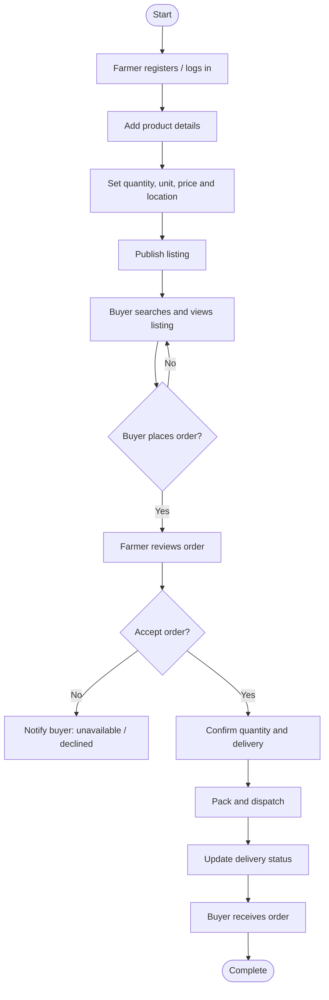
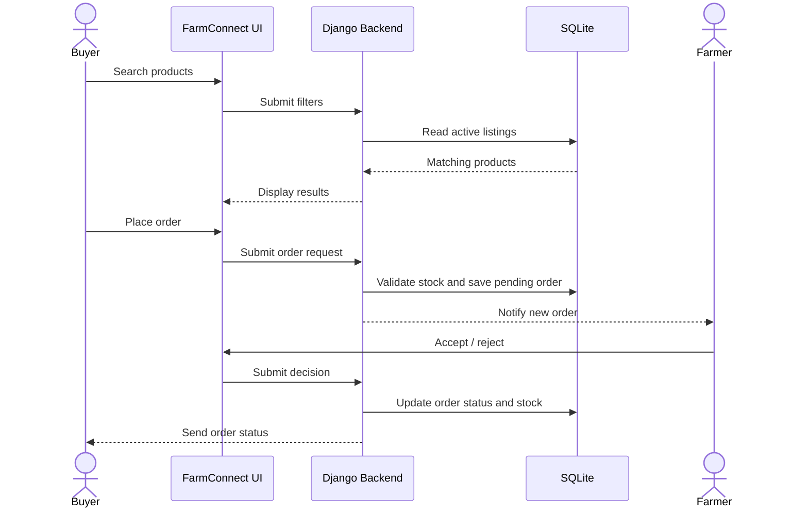

# FarmConnect — Workflow Diagrams

## Farmer listing to buyer delivery

```mermaid
flowchart TD
  A([Start]) --> B[Farmer registers / logs in]
  B --> C[Add product details]
  C --> D[Set quantity, unit, price and location]
  D --> E[Publish listing]
  E --> F[Buyer searches and views listing]
  F --> G{Buyer places order?}
  G -- No --> F
  G -- Yes --> H[Farmer reviews order]
  H --> I{Accept order?}
  I -- No --> J[Notify buyer: unavailable / declined]
  I -- Yes --> K[Confirm quantity and delivery]
  K --> L[Pack and dispatch]
  L --> M[Update delivery status]
  M --> N[Buyer receives order]
  N --> O([Complete])
```

## Order sequence

```mermaid
sequenceDiagram
  actor Buyer
  participant UI as FarmConnect UI
  participant App as Django Backend
  participant DB as SQLite
  actor Farmer
  Buyer->>UI: Search products
  UI->>App: Submit filters
  App->>DB: Read active listings
  DB-->>App: Matching products
  App-->>UI: Display results
  Buyer->>UI: Place order
  UI->>App: Submit order request
  App->>DB: Validate stock and save pending order
  App-->>Farmer: Notify new order
  Farmer->>UI: Accept / reject
  UI->>App: Submit decision
  App->>DB: Update order status and stock
  App-->>Buyer: Send order status
```
